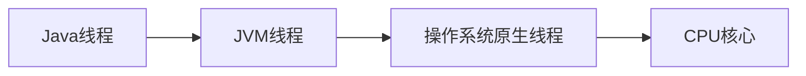
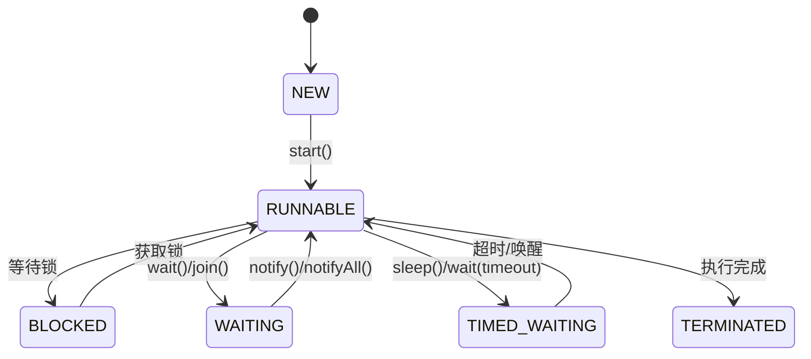

# Java多线程编程技术文档

## 一、基础概念

### 1. 线程与进程的区别

| 特性         | 进程                         | 线程                         |
|--------------|------------------------------|------------------------------|
| 资源分配     | 独立内存空间                 | 共享进程内存空间             |
| 通信方式     | IPC（管道、套接字等）        | 共享变量、队列               |
| 创建开销     | 大（需要复制资源）           | 小（共享资源）               |
| 上下文切换   | 开销大                       | 开销较小                     |
| 独立性       | 崩溃不影响其他进程           | 崩溃可能导致整个进程终止     |

### 2. Java多线程模型

Java线程通过JVM与操作系统线程实现1:1映射：



### 3. 线程生命周期



代码示例：

```java
Thread thread = new Thread(() -> {
    try {
        Thread.sleep(500); // 进入TIMED_WAITING状态
    } catch (InterruptedException e) {
        Thread.currentThread().interrupt();
    }
});
System.out.println(thread.getState()); // NEW
thread.start();
System.out.println(thread.getState()); // RUNNABLE
thread.join();
System.out.println(thread.getState()); // TERMINATED
```

### 4. 线程调度机制

- **抢占式调度**：高优先级线程抢占低优先级线程执行权
- **时间片轮转**：每个线程分配固定CPU时间片（通常10-100ms）
- Java线程优先级（1-10）仅作为调度器建议，不保证执行顺序

## 二、线程创建与启动

### 1. 继承Thread类
```java
class CustomThread extends Thread {
    @Override
    public void run() {
        System.out.println("Thread created by extending Thread");
    }
}
// 使用
new CustomThread().start();
```

### 2. 实现Runnable接口（推荐）
```java
class Task implements Runnable {
    @Override
    public void run() {
        System.out.println("Thread created by implementing Runnable");
    }
}
// 使用
new Thread(new Task()).start();
```

### 3. 实现Callable接口与Future
```java
Callable<Integer> callable = () -> {
    TimeUnit.SECONDS.sleep(1);
    return ThreadLocalRandom.current().nextInt(100);
};
ExecutorService executor = Executors.newSingleThreadExecutor();
Future<Integer> future = executor.submit(callable);
System.out.println("Future result: " + future.get()); // 阻塞等待结果
executor.shutdown();
```

### 4. 线程池
```java
ExecutorService executor = Executors.newFixedThreadPool(4);
List<Future<Integer>> futures = new ArrayList<>();
for (int i = 0; i < 10; i++) {
    futures.add(executor.submit(() -> {
        System.out.println(Thread.currentThread().getName() + " executing task");
        return 42;
    }));
}
executor.shutdown();
```

### 5. 对比与最佳实践
| 方式         | 优点                      | 缺点                     | 适用场景               |
|--------------|---------------------------|--------------------------|------------------------|
| Thread类     | 简单直接                  | 无法继承其他类           | 简单任务               |
| Runnable     | 接口灵活，可继承其他类    | 无返回值                 | 大多数场景             |
| Callable     | 支持返回值，异常处理      | 需要线程池配合           | 需要结果的任务         |
| 线程池       | 资源复用，管理方便        | 配置复杂                 | 生产环境首选           |

**最佳实践**：
- 优先选择Runnable/Callable接口
- 生产环境必须使用线程池
- 使用try-with-resources管理ExecutorService

## 三、线程同步与并发

### 1. 线程安全问题
```java
class Counter {
    private int count = 0;
    public void increment() {
        count++; // 非原子操作
    }
}
// 并发调用会导致计数错误
```

### 2. synchronized关键字
```java
// 对象锁
public synchronized void syncMethod() {
    // 临界区代码
}

// 显式锁
public void syncBlock() {
    synchronized(this) {
        // 临界区代码
    }
}

// 类锁
public static synchronized void staticSync() {
    // 锁定Class对象
}
```

### 3. ReentrantLock与Condition
```java
ReentrantLock lock = new ReentrantLock();
Condition condition = lock.newCondition();

lock.lock();
try {
    while (!conditionSatisfied) {
        condition.await(); // 释放锁并等待
    }
    // 执行操作
    condition.signalAll(); // 唤醒等待线程
} finally {
    lock.unlock();
}
```

### 4. 原子类
```java
AtomicInteger atomicInt = new AtomicInteger(0);
atomicInt.incrementAndGet(); // 原子操作

// 比较并交换(CAS)
boolean updated = atomicInt.compareAndSet(1, 2);
```

### 5. 并发集合
```java
ConcurrentMap<String, Integer> concurrentMap = new ConcurrentHashMap<>();
concurrentMap.compute("key", (k, v) -> v == null ? 1 : v + 1);

List<String> safeList = new CopyOnWriteArrayList<>();
safeList.add("item");
```

### 6. 锁优化技术
- **偏向锁**：无竞争时直接进入
- **轻量级锁**：CAS竞争失败升级为重量级锁
- **锁粗化**：合并连续加锁操作
- **锁消除**：JIT编译器移除非必要锁

## 四、线程间通信

### 1. wait()/notify()机制
```java
class SharedResource {
    private boolean ready = false;
    
    public synchronized void produce() {
        ready = true;
        notifyAll(); // 唤醒所有等待线程
    }
    
    public synchronized void consume() throws InterruptedException {
        while (!ready) {
            wait(); // 释放锁并等待
        }
        // 使用资源
    }
}
```

### 2. Condition接口
```java
ReentrantLock lock = new ReentrantLock();
Condition condition = lock.newCondition();

lock.lock();
try {
    condition.await();
    // ...
    condition.signal();
} finally {
    lock.unlock();
}
```

### 3. 阻塞队列
```java
BlockingQueue<String> queue = new ArrayBlockingQueue<>(10);

// 生产者
queue.put("data");

// 消费者
String data = queue.take();
```

### 4. 管道流
```java
PipedInputStream pis = new PipedInputStream();
PipedOutputStream pos = new PipedOutputStream(pis);

// 写线程
pos.write("data".getBytes());

// 读线程
int data = pis.read();
```

## 五、高级工具类

### 1. CountDownLatch
```java
CountDownLatch latch = new CountDownLatch(3);

// 工作线程
new Thread(() -> {
    // 执行任务
    latch.countDown();
}).start();

latch.await(); // 主线程等待
System.out.println("All tasks completed");
```

### 2. CyclicBarrier
```java
CyclicBarrier barrier = new CyclicBarrier(3, 
    () -> System.out.println("All parties reached barrier"));

IntStream.range(0, 3).forEach(i -> new Thread(() -> {
    try {
        System.out.println("Party " + i + " arrived");
        barrier.await(); // 等待其他线程
    } catch (Exception e) {
        Thread.currentThread().interrupt();
    }
}).start());
```

### 3. Semaphore
```java
Semaphore semaphore = new Semaphore(3); // 允许3个并发访问

semaphore.acquire();
try {
    // 访问受限资源
} finally {
    semaphore.release();
}
```

### 4. Exchanger
```java
Exchanger<String> exchanger = new Exchanger<>();

new Thread(() -> {
    try {
        String received = exchanger.exchange("Data from Thread A");
        System.out.println("Received: " + received);
    } catch (InterruptedException e) {
        Thread.currentThread().interrupt();
    }
}).start();

String result = exchanger.exchange("Data from Thread B");
```

### 5. Phaser
```java
Phaser phaser = new Phaser(1); // 主线程注册

IntStream.range(0, 3).forEach(i -> {
    phaser.register();
    new Thread(() -> {
        System.out.println("Phase-" + phaser.getPhase() + " started");
        phaser.arriveAndAwaitAdvance();
        // ...下一阶段任务
    }).start();
});

phaser.arriveAndDeregister(); // 主线程完成
```

## 六、线程池原理与实践

### 1. 线程池核心参数
```java
ThreadPoolExecutor executor = new ThreadPoolExecutor(
    5,      // corePoolSize
    10,     // maximumPoolSize
    60,     // keepAliveTime（秒）
    TimeUnit.SECONDS,
    new ArrayBlockingQueue<>(100), // 工作队列
    new ThreadPoolExecutor.CallerRunsPolicy() // 拒绝策略
);
```

### 2. 工作队列对比
| 队列类型                | 特性                          | 适用场景                     |
|-------------------------|-------------------------------|------------------------------|
| ArrayBlockingQueue      | 有界FIFO队列                  | 固定大小线程池               |
| LinkedBlockingQueue     | 可选有界/无界队列             | 默认工作队列                 |
| SynchronousQueue        | 不存储元素的队列              | 直接传递任务                 |
| PriorityBlockingQueue   | 优先级排序队列                | 任务优先级处理               |

### 3. 拒绝策略
- **AbortPolicy**：默认策略，抛出RejectedExecutionException
- **CallerRunsPolicy**：调用者线程执行任务
- **DiscardPolicy**：静默丢弃任务
- **DiscardOldestPolicy**：丢弃队列最旧任务

### 4. 自定义线程池配置
```java
ThreadFactory factory = r -> {
    Thread t = new Thread(r);
    t.setName("custom-thread-" + t.getId());
    t.setUncaughtExceptionHandler((thread, ex) -> 
        System.err.println("Exception in thread " + thread.getName() + ": " + ex));
    return t;
};

ThreadPoolExecutor executor = new ThreadPoolExecutor(
    4, 8, 30, TimeUnit.SECONDS,
    new LinkedBlockingQueue<>(50),
    factory,
    new ThreadPoolExecutor.AbortPolicy()
);
```

### 5. 监控与调优
```java
// 监控指标
executor.getPoolSize();      // 当前线程数
executor.getActiveCount();   // 活动线程数
executor.getTaskCount();     // 总任务数
executor.getCompletedTaskCount(); // 已完成任务数

// 调优建议
// CPU密集型：线程数 = CPU核心数 + 1
// IO密集型：线程数 = CPU核心数 * (1 + 平均等待时间/平均计算时间)
```

## 七、线程安全设计模式

### 1. 不可变对象模式
```java
@Immutable
public final class ImmutablePoint {
    private final int x;
    private final int y;
    
    public ImmutablePoint(int x, int y) {
        this.x = x;
        this.y = y;
    }
    // 无setter方法
}
```

### 2. 线程封闭模式
```java
private static ThreadLocal<SimpleDateFormat> dateFormat = 
    ThreadLocal.withInitial(() -> new SimpleDateFormat("yyyy-MM-dd"));

public String formatDate(Date date) {
    return dateFormat.get().format(date);
}
```

### 3. 生产者-消费者模式
```java
BlockingQueue<Item> queue = new LinkedBlockingQueue<>();

// 生产者
queue.put(new Item());

// 消费者
Item item = queue.take();
```

### 4. 两阶段终止模式
```java
class WorkerThread extends Thread {
    private volatile boolean running = true;
    
    public void run() {
        while (running) {
            try {
                // 执行任务
                TimeUnit.MILLISECONDS.sleep(100);
            } catch (InterruptedException e) {
                Thread.currentThread().interrupt();
            }
        }
        // 清理资源
    }
    
    public void terminate() {
        running = false;
        interrupt(); // 中断可能存在的等待
    }
}
```

### 5. 保护性暂停模式
```java
class GuardedObject<T> {
    private T obj;
    private final Object lock = new Object();
    
    public T get() throws InterruptedException {
        synchronized(lock) {
            while (obj == null) {
                lock.wait();
            }
            return obj;
        }
    }
    
    public void set(T obj) {
        synchronized(lock) {
            this.obj = obj;
            lock.notifyAll();
        }
    }
}
```

## 八、性能优化与调试

### 1. 监控工具
| 工具       | 功能                      |
|------------|---------------------------|
| jstack     | 线程转储分析              |
| jconsole   | 图形化监控JMX指标         |
| VisualVM   | 综合性能分析工具          |
| Java Mission Control | 生产级监控分析 |

### 2. 死锁检测与避免
```java
// 检测死锁
ThreadMXBean threadMXBean = ManagementFactory.getThreadMXBean();
long[] threadIds = threadMXBean.findDeadlockedThreads();
if (threadIds != null) {
    System.err.println("Deadlock detected!");
}

// 避免死锁策略：
// 1. 固定加锁顺序
// 2. 使用tryLock超时机制
// 3. 减少同步范围
```

### 3. 上下文切换开销
- **症状**：CPU使用率高但吞吐量低
- **优化**：
  - 减少线程数量（使用合理大小的线程池）
  - 使用无锁数据结构
  - 减少同步块范围

### 4. 锁粒度优化
```java
// 粗粒度锁（性能差）
synchronized(this) {
    // 访问所有字段
}

// 细粒度锁（推荐）
private final Object field1Lock = new Object();
private final Object field2Lock = new Object();

synchronized(field1Lock) {
    // 访问field1
}
synchronized(field2Lock) {
    // 访问field2
}
```

### 5. 无锁算法与CAS
```java
AtomicInteger counter = new AtomicInteger();

// 无锁递增
public int increment() {
    int current;
    do {
        current = counter.get();
    } while (!counter.compareAndSet(current, current + 1));
    return current + 1;
}
```

## 九、实战案例

### 1. 高并发Web服务器线程模型
```java
ExecutorService serverExecutor = Executors.newVirtualThreadExecutor(); // Java 19+
try (ServerSocket serverSocket = new ServerSocket(8080)) {
    while (true) {
        Socket socket = serverSocket.accept();
        serverExecutor.submit(() -> handleRequest(socket));
    }
}
```

### 2. 定时任务调度
```java
ScheduledExecutorService scheduler = Executors.newScheduledThreadPool(2);

// 固定速率执行
scheduler.scheduleAtFixedRate(() -> 
    System.out.println("Fixed rate task"), 1, 1, TimeUnit.SECONDS);

// 固定延迟执行
scheduler.scheduleWithFixedDelay(() -> 
    System.out.println("Fixed delay task"), 1, 1, TimeUnit.SECONDS);
```

### 3. 并行数据处理
```java
List<Integer> data = IntStream.range(0, 100000).boxed().collect(Collectors.toList());

// 使用并行流
long count = data.parallelStream()
                .filter(i -> i % 2 == 0)
                .count();

// 使用Fork/Join框架
class SumTask extends RecursiveTask<Long> {
    private static final int THRESHOLD = 1000;
    private final List<Integer> list;
    
    SumTask(List<Integer> list) { this.list = list; }
    
    @Override
    protected Long compute() {
        if (list.size() <= THRESHOLD) {
            return list.stream().mapToLong(i -> i).sum();
        }
        int mid = list.size() / 2;
        SumTask left = new SumTask(list.subList(0, mid));
        SumTask right = new SumTask(list.subList(mid, list.size()));
        left.fork();
        return right.compute() + left.join();
    }
}

ForkJoinPool pool = new ForkJoinPool();
long sum = pool.invoke(new SumTask(data));
```

### 4. 响应式编程基础
```java
CompletableFuture.supplyAsync(() -> fetchDataFromDB())
    .thenApply(data -> transformData(data))
    .thenAccept(result -> sendResult(result))
    .exceptionally(ex -> {
        System.err.println("Error: " + ex.getMessage());
        return null;
    });
```

## 十、常见误区与最佳实践

### 1. 避免线程泄漏
```java
// 错误：未关闭线程池
ExecutorService executor = Executors.newFixedThreadPool(4);

// 正确：使用try-with-resources
try (ExecutorService executor = Executors.newVirtualThreadExecutor()) {
    executor.submit(() -> System.out.println("Task"));
}
```

### 2. 合理配置线程池大小
```java
int cpuCores = Runtime.getRuntime().availableProcessors();
// CPU密集型
int cpuBoundPoolSize = cpuCores + 1;
// IO密集型
int ioBoundPoolSize = cpuCores * 2;
```

### 3. 避免过度同步
```java
// 错误：过度同步
public synchronized List<String> getItems() {
    return new ArrayList<>(items); // 复制操作不需要同步
}

// 正确：最小化同步范围
public List<String> getItems() {
    synchronized(lock) {
        return new ArrayList<>(items);
    }
}
```

### 4. 正确处理线程中断
```java
public void run() {
    try {
        while (!Thread.currentThread().isInterrupted()) {
            // 执行任务
        }
    } finally {
        // 清理资源
    }
}
```

### 5. 资源释放与优雅关闭
```java
ExecutorService executor = Executors.newFixedThreadPool(4);
// ...
executor.shutdown(); // 停止接受新任务
try {
    if (!executor.awaitTermination(60, TimeUnit.SECONDS)) {
        executor.shutdownNow(); // 取消正在执行的任务
    }
} catch (InterruptedException ex) {
    executor.shutdownNow();
    Thread.currentThread().interrupt();
}
```

## 面试题精选

**Q1：synchronized和ReentrantLock有什么区别？**
- synchronized是JVM内置锁，ReentrantLock是API级锁
- ReentrantLock支持公平锁、可中断锁、超时锁
- ReentrantLock提供Condition更灵活的等待通知机制
- synchronized自动释放锁，ReentrantLock需要手动释放

**Q2：如何避免死锁？**
- 固定资源请求顺序
- 使用tryLock()超时机制
- 减少同步范围
- 使用线程转储工具检测死锁
- 使用无锁数据结构

**Q3：ThreadLocal有哪些使用场景？**
- 保存线程上下文信息（如用户会话）
- 避免参数传递（如数据库连接）
- 线程安全的日期格式化
- 性能优化（重用对象）

**Q4：volatile关键字的作用？**
- 保证变量可见性（直接读写主内存）
- 禁止指令重排序（内存屏障）
- 不保证原子性（复合操作仍需同步）

**Q5：什么是CAS操作？**
- Compare-And-Swap（比较并交换）
- 无锁算法的核心实现
- 原子操作，由CPU指令支持
- 存在ABA问题（可通过版本号解决）

## 性能对比数据
| 操作                     | 执行时间（100万次） |
|--------------------------|---------------------|
| synchronized方法         | 120 ms              |
| ReentrantLock            | 105 ms              |
| AtomicInteger（CAS）     | 45 ms               |
| volatile读               | 10 ms               |
| 普通变量读               | 5 ms                |

**调优建议**：
- 读多写少场景：使用乐观锁（CAS）
- 写多场景：考虑锁分段技术
- 极高并发：使用无锁数据结构
- Java 19+：优先使用虚拟线程
